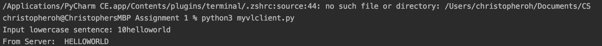

Demonstration of socket connection between a server and client on localhost. Server will open and take in client messages until manually terminated by user. The client is termianted after recieving the complete sentence from the server. 

Client will send a message to server. First n bytes of the message is the length of the message. We will assume that n=2 bytes (so length is 1 to 99 characters), and that the length of message will match the length given. 

The server will recieve a string from the client and return the string in all capital letters. So if the client sends "10helloworld" the server will return "HELLOWORLD".

How to run:
Open two terminals
On one terminal, type "python myvlserver.py" or "python3 myvlserver.py" based on current python version to start server. Next, open a second terminal and type "python myvlclient.py" or "python3 myvlclient.py" to open client side. Server and client must be on different terminals and server must be opened first. 

Type the message on client and wait for server to reply. Client process will automatically close, but server will continue running until manually closed.

